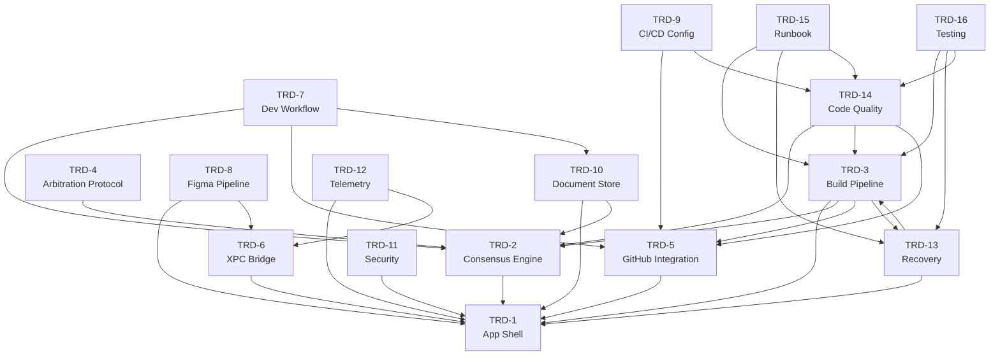

# BUILD_ORDER.md -- Authoritative Build Prioritization & Gap Analysis

> **Document Status:** Canonical · v1.0
> **Effective Date:** 2026-03-28
> **Authority:** PRD-001 § Sequencing Reference
> **Owner:** Forge Platform Engineering
> **Scope:** All 16 TRDs for the Crafted Dev Agent platform

---

## 1. Purpose

This document is the **single authoritative sequencing reference** for the Crafted Dev Agent platform build. It establishes:

1. The canonical build prioritization order across all 16 Technical Requirements Documents (TRDs).
2. The inter-TRD dependency graph with explicit directed edges.
3. A comprehensive gap analysis cataloguing every discovered issue -- missing data, naming collisions, path placement ambiguities, and undefined cross-references.
4. Best-practice resolution decisions for each gap, with rationale and downstream impact.
5. Mode-scoped build phases covering FOUNDER mode (TRD-7 §3-6) and CONSULTANT mode (TRD-7 §21).
6. Figma pipeline placement per TRD-8 v2.0.
7. Interpretation rules establishing this document's authority for all subsequent PRDs and implementation PRs.

**No implementation PR may land without its target TRD(s) being satisfied in the build order defined here.** Any conflict between a TRD's text and this document's sequencing decisions is resolved per the Interpretation Rules in §12.

---

## 2. Assumptions & Terminology

### 2.1 Terminology

| Term | Definition |
|---|---|
| **TRD** | Technical Requirements Document -- a versioned specification for a single subsystem or cross-cutting concern. |
| **PRD** | Product Requirements Document -- a scoped implementation plan that references one or more TRDs. |
| **Build Phase** | A numbered tier in the topological build order. All TRDs in Phase N have their dependencies fully satisfied by Phases 0 through N−1. |
| **Dependency Edge** | A directed relationship `TRD-X → TRD-Y` meaning "TRD-X requires TRD-Y to be defined/built first." The arrow points from dependent to dependency. |
| **FOUNDER Mode** | Full agent build pipeline scope as defined in TRD-7 §3-6. Covers all subsystems needed to build the Crafted Dev Agent itself. |
| **CONSULTANT Mode** | Reduced external-project scope as defined in TRD-7 §21. Covers subsystems needed when the agent operates on third-party repositories. |
| **DAG** | Directed Acyclic Graph -- a graph with directed edges and no cycles. |
| **Gap** | Any missing, ambiguous, conflicting, or undefined element discovered during dependency and content analysis of the TRDs. |
| **Canonical Path** | The single authoritative filesystem path for a given artifact, as resolved by this document. |
| **Legacy Path** | A `forge-*` prefixed path retained for backward compatibility under documented exception per PRD-001. |
| **Owner Process** | The primary runtime process that implements a TRD's subsystem: Swift (macOS native), Python (agent engine), or Both. |

### 2.2 Assumptions

1. **All 16 TRDs are enumerated as TRD-1 through TRD-16.** The numbering is sequential; no TRD numbers are skipped or reserved.
2. **TRD version references** in this document reflect the latest known versions as of the effective date. If a TRD is updated after this document's effective date, a reconciliation review is required per Interpretation Rule IR-3.
3. **The Crafted Dev Agent repository** is the single monorepo containing Swift (macOS app) and Python (agent engine) code, plus all standards and documentation.
4. **`forge-*` directory prefixes** (e.g., `forge-standards/`, `forge-docs/`) are retained as legacy exceptions per PRD-001 §Naming Migration. New subsystems use `Crafted-*` naming unless explicitly exempted.
5. **TRD-7 mode definitions** are authoritative for scoping. If a TRD does not explicitly state its mode applicability, this document assigns it based on functional analysis and records the assignment as a gap resolution.
6. **No TRD is optional.** Every TRD must appear in exactly one build phase. TRDs that are "scoping overlays" (e.g., TRD-7) are placed in the phase where their specification must be finalized, even if they do not produce runtime artifacts.

---

## 3. TRD Inventory

The following table enumerates all 16 TRDs with their metadata as extracted from the document corpus.

| TRD ID | Title | Version | Primary Subsystem | Owner Process | Depends On (declared) |
|--------|-------|---------|-------------------|---------------|----------------------|
| TRD-1 | macOS Application Shell | v2.0 | App Shell, XPC, project schema | Swift | -- (foundation) |
| TRD-2 | Consensus Engine | v3.0 | LLM orchestration, prompt routing | Python | TRD-1 |
| TRD-3 | Build Pipeline and Iterative Code Quality Engine | v7.0 | End-to-end build automation | Python | TRD-1, TRD-2, TRD-5, TRD-13 |
| TRD-4 | Consensus Arbitration Protocol | v2.0 | Multi-model arbitration logic | Python | TRD-2 |
| TRD-5 | GitHub Integration | v3.0 | Git operations, PR lifecycle, branch management | Python | TRD-1 |
| TRD-6 | XPC Bridge Protocol | v2.0 | Swift ↔ Python IPC wire protocol | Both | TRD-1 |
| TRD-7 | TRD Development Workflow | v2.0 | Mode scoping, workflow definitions | Both | TRD-2, TRD-5, TRD-10 |
| TRD-8 | Figma Design Pipeline | v2.0 | Design token extraction, asset generation | Both | TRD-1, TRD-6 |
| TRD-9 | CI/CD Pipeline Configuration | v2.0 | GitHub Actions, automated testing infra | Python | TRD-5, TRD-14 |
| TRD-10 | Document Store and Retrieval Engine | v1.0 | TRD/PRD storage, vector search, context injection | Python | TRD-1, TRD-2 |
| TRD-11 | Security Architecture | v2.0 | Auth, crypto, secrets management, threat model | Both | TRD-1 |
| TRD-12 | Telemetry and Observability | v1.0 | Logging, metrics, tracing, audit trail | Both | TRD-1, TRD-6 |
| TRD-13 | Recovery and State Management | v6.0 | Crash recovery, checkpoint persistence, state machine | Python | TRD-1, TRD-3 |
| TRD-14 | Code Quality and CI Pipeline | v3.0 | Linting, formatting, test harness, CI gates | Python | TRD-2, TRD-3, TRD-5 |
| TRD-15 | Agent Operational Runbook | v1.2 | Operational procedures, incident response | Both | TRD-3, TRD-13, TRD-14 |
| TRD-16 | Agent Testing and Validation | v3.1 | Test strategy, validation harness, confidence gates | Python | TRD-3, TRD-13, TRD-14 |

> **Note:** Where a TRD's declared dependencies are incomplete or conflict with functional analysis, the discrepancy is recorded in the Gap Analysis Register (§8).

---

## 4. Dependency Graph

### 4.1 Mermaid Diagram

### 4.2 Adjacency List

The following adjacency list represents the dependency graph as `Dependent → [Dependencies]`. Every edge is directed: the dependent TRD requires all listed dependencies to be defined/built in a prior or same phase.

| TRD (Dependent) | Depends On |
|---|---|
| TRD-1 | *(none -- foundation)* |
| TRD-2 | TRD-1 |
| TRD-3 | TRD-1, TRD-2, TRD-5, TRD-13 |
| TRD-4 | TRD-2 |
| TRD-5 | TRD-1 |
| TRD-6 | TRD-1 |
| TRD-7 | TRD-2, TRD-5, TRD-10 |
| TRD-8 | TRD-1, TRD-6 |
| TRD-9 | TRD-5, TRD-14 |
| TRD-10 | TRD-1, TRD-2 |
| TRD-11 | TRD-1 |
| TRD-12 | TRD-1, TRD-6 |
| TRD-13 | TRD-1, TRD-3 |
| TRD-14 | TRD-2, TRD-3, TRD-5 |
| TRD-15 | TRD-3, TRD-13, TRD-14 |
| TRD-16 | TRD-3, TRD-13, TRD-14 |

### 4.3 Cycle Analysis

**Identified Cycle:** TRD-3 ↔ TRD-13

- TRD-3 (Build Pipeline) v7.0 declares a dependency on TRD-13 (Recovery).
- TRD-13 (Recovery) v6.0 declares a dependency on TRD-3 (Build Pipeline).

This creates a cycle: `TRD-3 → TRD-13 → TRD-3`.

**Resolution (see GAP-001):** The cycle is broken by splitting the dependency into two phases:

1. **TRD-3 Phase A (Core Build Pipeline):** The core build pipeline specification (PR decomposition, code generation, pre-commit validation) does NOT require TRD-13. TRD-3's dependency on TRD-13 is specifically for checkpoint recovery during builds, which is an enhancement layered on after the core pipeline exists.
2. **TRD-13 depends on TRD-3 Phase A.** Recovery state management requires the build pipeline's state model to be defined first.
3. **TRD-3 Phase B (Recovery-Integrated Pipeline)** then depends on TRD-13 to add checkpoint/recovery support to the build pipeline.

For build ordering purposes, TRD-3 is placed in an earlier phase than TRD-13, with the understanding that TRD-3's recovery integration features are deferred to after TRD-13 lands. This is recorded as GAP-001 and reflected in the build phases below.

**Resolved DAG property:** After cycle resolution, the dependency graph is a valid DAG. No other cycles exist.

---

## 5. Topological Build Order

Build phases are numbered starting at Phase 0 (foundation). Within a phase, TRDs may be built in parallel. A TRD in Phase N has all its dependencies satisfied by Phases 0 through N−1.

### Phase 0 -- Foundation

| TRD | Rationale |
|---|---|
| **TRD-1: macOS Application Shell** | Zero dependencies. Defines the app shell, project schema, file layout, and XPC progress message types that all other TRDs reference. Must land first. |

### Phase 1 -- Core Infrastructure

| TRD | Rationale |
|---|---|
| **TRD-2: Consensus Engine** | Depends only on TRD-1. Provides LLM orchestration and prompt routing consumed by TRD-3, TRD-4, TRD-7, TRD-10, TRD-14. |
| **TRD-5: GitHub Integration** | Depends only on TRD-1. Provides Git operations and PR lifecycle consumed by TRD-3, TRD-7, TRD-9, TRD-14. |
| **TRD-6: XPC Bridge Protocol** | Depends only on TRD-1. Defines the Swift ↔ Python wire protocol consumed by TRD-8, TRD-12. |
| **TRD-11: Security Architecture** | Depends only on TRD-1. Cross-cutting security specification (auth, crypto, secrets) that should be defined early to inform all subsequent implementation. |

### Phase 2 -- Engine Layer

| TRD | Rationale |
|---|---|
| **TRD-4: Consensus Arbitration Protocol** | Depends on TRD-2. Extends the consensus engine with multi-model arbitration. |
| **TRD-10: Document Store and Retrieval Engine** | Depends on TRD-1, TRD-2. Provides TRD/PRD storage and context injection for TRD-7. |
| **TRD-8: Figma Design Pipeline** | Depends on TRD-1, TRD-6. Design token extraction and asset generation pipeline. |
| **TRD-12: Telemetry and Observability** | Depends on TRD-1, TRD-6. Logging, metrics, and audit trail infrastructure. |

### Phase 3 -- Build Pipeline Core

| TRD | Rationale |
|---|---|
| **TRD-3: Build Pipeline and Iterative Code Quality Engine** | Depends on TRD-1, TRD-2, TRD-5. The TRD-13 dependency is deferred per GAP-001 cycle resolution -- TRD-3 Phase A (core pipeline) lands here without recovery integration. |

### Phase 4 -- Recovery & Quality

| TRD | Rationale |
|---|---|
| **TRD-13: Recovery and State Management** | Depends on TRD-1, TRD-3 (Phase A). Checkpoint persistence and crash recovery. |
| **TRD-14: Code Quality and CI Pipeline** | Depends on TRD-2, TRD-3, TRD-5. Linting, formatting, test harness, CI gates. |

### Phase 5 -- Workflow & CI

| TRD | Rationale |
|---|---|
| **TRD-7: TRD Development Workflow** | Depends on TRD-2, TRD-5, TRD-10. Mode definitions and workflow scoping. |
| **TRD-9: CI/CD Pipeline Configuration** | Depends on TRD-5, TRD-14. GitHub Actions and automated testing infrastructure. |

### Phase 6 -- Validation & Operations

| TRD | Rationale |
|---|---|
| **TRD-15: Agent Operational Runbook** | Depends on TRD-3, TRD-13, TRD-14. Cannot be finalized until operational subsystems are defined. |
| **TRD-16: Agent Testing and Validation** | Depends on TRD-3, TRD-13, TRD-14. End-to-end test strategy and confidence gate validation. |

### Phase Summary Table

| Phase | TRDs | Count |
|---|---|---|
| Phase 0 -- Foundation | TRD-1 | 1 |
| Phase 1 -- Core Infrastructure | TRD-2, TRD-5, TRD-6, TRD-11 | 4 |
| Phase 2 -- Engine Layer | TRD-4, TRD-8, TRD-10, TRD-12 | 4 |
| Phase 3 -- Build Pipeline Core | TRD-3 | 1 |
| Phase 4 -- Recovery & Quality | TRD-13, TRD-14 | 2 |
| Phase 5 -- Workflow & CI | TRD-7, TRD-9 | 2 |
| Phase 6 -- Validation & Operations | TRD-15, TRD-16 | 2 |
| **Total** | | **16** |

> **Verification:** Every TRD (TRD-1 through TRD-16) appears in exactly one phase. No orphans, no duplicates. All dependency edges point from higher phases to lower phases, confirming valid topological order.

---

## 6. Mode Scoping Matrix

TRD-7 v2.0 defines two operational modes:

- **FOUNDER Mode (§3-6):** Full agent build pipeline -- building the Crafted Dev Agent itself. All subsystems are in scope.
- **CONSULTANT Mode (§21):** Reduced scope for operating on external/third-party repositories. Only subsystems needed for external project work are in scope.

The following matrix assigns each TRD to one or both modes based on functional analysis of TRD-7's mode definitions and each TRD's subsystem scope.

| TRD ID | Title | FOUNDER Mode | CONSULTANT Mode | Rationale |
|--------|-------|:---:|:---:|---|
| TRD-1 | macOS Application Shell | ✅ | ✅ | App shell is required in both modes -- it is the runtime container. |
| TRD-2 | Consensus Engine | ✅ | ✅ | LLM orchestration is needed for code generation in both modes. |
| TRD-3 | Build Pipeline | ✅ | ✅ | Build pipeline drives PR generation in both modes. |
| TRD-4 | Arbitration Protocol | ✅ | ✅ | Multi-model arbitration applies to all code generation tasks. |
| TRD-5 | GitHub Integration | ✅ | ✅ | Git operations are required for any repository interaction. |
| TRD-6 | XPC Bridge | ✅ | ✅ | IPC between Swift shell and Python engine is always required. |
| TRD-7 | Dev Workflow | ✅ | ✅ | Workflow definitions apply to both modes (mode switching is itself defined here). |
| TRD-8 | Figma Pipeline | ✅ | ⚠️ OPTIONAL | Figma pipeline is primarily for Crafted's own UI. External projects may optionally use it. See GAP-008. |
| TRD-9 | CI/CD Config | ✅ | ✅ | CI pipeline applies to all projects the agent operates on. |
| TRD-10 | Document Store | ✅ | ⚠️ REDUCED | FOUNDER mode uses full TRD/PRD store. CONSULTANT mode uses reduced document context (project docs, not Crafted TRDs). See GAP-009. |
| TRD-11 | Security Architecture | ✅ | ✅ | Security is cross-cutting and mandatory in all modes. |
| TRD-12 | Telemetry | ✅ | ✅ | Observability is required regardless of mode. |
| TRD-13 | Recovery | ✅ | ✅ | Crash recovery applies to all build runs. |
| TRD-14 | Code Quality | ✅ | ✅ | Linting and quality gates apply to all generated code. |
| TRD-15 | Runbook | ✅ | ⚠️ REDUCED | Operational runbook is fully applicable in FOUNDER mode. CONSULTANT mode uses a subset (incident response, not internal deployment procedures). See GAP-010. |
| TRD-16 | Testing & Validation | ✅ | ✅ | Validation harness applies to all modes. |

**Legend:**
- ✅ = Fully in scope
- ⚠️ OPTIONAL = Available but not required
- ⚠️ REDUCED = In scope with reduced feature surface

### Phase-Level Mode Scoping

| Phase | FOUNDER Mode | CONSULTANT Mode |
|---|---|---|
| Phase 0 -- Foundation | Full | Full |
| Phase 1 -- Core Infrastructure | Full | Full |
| Phase 2 -- Engine Layer | Full | Reduced (TRD-8 optional, TRD-10 reduced) |
| Phase 3 -- Build Pipeline Core | Full | Full |
| Phase 4 -- Recovery & Quality | Full | Full |
| Phase 5 -- Workflow & CI | Full | Full |
| Phase 6 -- Validation & Operations | Full | Reduced (TRD-15 reduced) |

---

## 7. Figma Pipeline Placement (TRD-8 v2.0)

### 7.1 Position in Dependency Graph

TRD-8 (Figma Design Pipeline) v2.0 is placed in **Phase 2 -- Engine Layer**.

**Dependency Edges:**

| Direction | Edge | Description |
|---|---|---|
| Inbound (TRD-8 depends on) | TRD-1 → TRD-8 | App shell provides the project schema, file layout conventions, and Swift build target structure that TRD-8's generated assets must conform to. |
| Inbound (TRD-8 depends on) | TRD-6 → TRD-8 | XPC bridge protocol defines the message types used to stream Figma pipeline progress from Python to the Swift UI. |
| Outbound (depends on TRD-8) | TRD-8 → TRD-7 | *Implicit.* TRD-7's FOUNDER mode workflow may include Figma-to-code steps. This is an optional integration, not a hard dependency. See GAP-011. |

### 7.2 Inputs and Outputs

| Category | Detail |
|---|---|
| **Inputs** | Figma API access tokens (secrets -- never hardcoded, managed per TRD-11), Figma file/project URLs, design token schemas, component mapping configuration |
| **Outputs** | Generated Swift UI components, CSS/design token files, asset catalogs (`.xcassets`), component inventory manifest |
| **Integration Points** | XPC progress messages (TRD-6 wire protocol), project file layout (TRD-1 schema), security constraints on token storage (TRD-11) |

### 7.3 Mode Applicability

- **FOUNDER Mode:** Fully in scope. The Crafted app's own UI is designed in Figma and the pipeline generates production Swift UI code.
- **CONSULTANT Mode:** Optional. External projects may use the Figma pipeline if their design workflow includes Figma. Not required for core CONSULTANT functionality.

---

## 8. Gap Analysis Register

Every gap discovered during TRD analysis is catalogued below. Each entry includes a unique ID, source TRD(s), gap type, description, severity, resolution decision, rationale, and downstream impact.

### Severity Definitions

| Severity | Definition |
|---|---|
| **CRITICAL** | Blocks build ordering or creates an impossible dependency. Must be resolved before any implementation PR. |
| **HIGH** | Creates ambiguity that will cause conflicting implementations if not resolved. Must be resolved before the affected TRD's phase begins. |
| **MEDIUM** | Creates minor ambiguity or inconsistency. Should be resolved before the affected TRD's implementation PR but does not block ordering. |
| **LOW** | Cosmetic or documentation-only issue. Can be resolved during implementation. |

### Gap Register Table

| Gap ID | TRD Source | Gap Type | Description | Severity | Resolution | Rationale | Downstream Impact | Status |
|--------|-----------|----------|-------------|----------|------------|-----------|-------------------|--------|
| GAP-001 | TRD-3, TRD-13 | Circular Dependency | TRD-3 v7.0 declares dependency on TRD-13; TRD-13 v6.0 declares dependency on TRD-3. This creates a cycle in the build graph. | CRITICAL | Break cycle by phasing TRD-3. TRD-3 Phase A (core pipeline) has no TRD-13 dependency. TRD-13 depends on TRD-3 Phase A. TRD-3 Phase B (recovery integration) follows TRD-13. | TRD-3's core build pipeline (PR decomposition, code gen, validation) is functionally independent of recovery. Recovery integration is an enhancement. | TRD-3 implementation must be split into two sub-PRs: core pipeline (Phase 3) and recovery integration (post-Phase 4). TRD-13 and TRD-14 can proceed after TRD-3 Phase A. | RESOLVED |
| GAP-002 | TRD-14 | Circular Dependency Risk | TRD-14 v3.0 declares dependencies on TRD-2, TRD-3, and TRD-5. TRD-3 v7.0 declares dependency on TRD-13 v6.0. TRD-14 includes CI gates that TRD-3 references. Potential implicit cycle via TRD-3 ↔ TRD-14. | HIGH | TRD-14's CI gates are consumed by TRD-3 as configuration, not as a build-time dependency. TRD-3 Phase A defines the pipeline without requiring TRD-14's gates to exist. TRD-14 is placed in Phase 4, after TRD-3 Phase A. | The build pipeline specifies *where* CI gates run; the code quality TRD specifies *what* gates run. These can be developed in sequence. | TRD-3 Phase A PRs must use placeholder CI gate configuration. TRD-14 PRs then provide the actual gate definitions. | RESOLVED |
| GAP-003 | TRD-11 | Missing Cross-Reference | TRD-11 (Security) is referenced implicitly by nearly every TRD (auth, crypto, secrets) but is not listed as an explicit dependency by most TRDs. | HIGH | TRD-11 is placed in Phase 1 as a cross-cutting specification. All Phase 2+ implementations must conform to TRD-11's security requirements, even if not explicitly declared as a dependency in their TRD header. | Security-by-design requires the security architecture to be defined before any subsystem that handles secrets, auth tokens, or crypto operations. Forge standards mandate deny-by-default. | All implementation PRs must include TRD-11 compliance verification in their review checklist. | RESOLVED |
| GAP-004 | TRD-1, TRD-6 | Interface Ambiguity | TRD-1 defines XPC progress message types. TRD-6 defines the XPC wire protocol. The boundary between "message types" (TRD-1) and "wire protocol" (TRD-6) is not precisely delineated. | MEDIUM | TRD-1 owns the message type enumeration and semantic definitions. TRD-6 owns the serialization format, transport mechanism, and error handling protocol. TRD-6's implementation must import TRD-1's message type definitions, not redefine them. | Clear ownership prevents duplicate or conflicting message type definitions. | TRD-6 implementation PRs must reference TRD-1's message type enum as a shared dependency. A shared schema file is required (see Path Placement Decisions §10). | RESOLVED |
| GAP-005 | TRD-7 | Mode Scope Underspecification | TRD-7 §21 defines CONSULTANT mode but does not enumerate which TRDs are in/out of scope. Mode applicability must be inferred from functional analysis. | HIGH | This document's Mode Scoping Matrix (§6) is the authoritative mode assignment. Each TRD's mode applicability is explicitly assigned with rationale. | Without explicit mode assignments, implementation agents may build FOUNDER-only features in CONSULTANT mode PRs, or vice versa. | All PRDs must reference this document's Mode Scoping Matrix when defining PR scope. | RESOLVED |
| GAP-006 | TRD-3, TRD-14 | Version Mismatch in conftest.py Scope | Both TRD-3 v7.0 and TRD-14 v3.0 reference `conftest.py` auto-commit behavior. Ownership of the conftest.py specification is ambiguous. | MEDIUM | TRD-14 owns the conftest.py specification (test infrastructure). TRD-3 references TRD-14's conftest.py as a consumed dependency. | TRD-14 is the Code Quality TRD -- test configuration files are squarely in its domain. TRD-3's reference should be a cross-reference, not a parallel specification. | TRD-3 implementation must not define conftest.py behavior independently; it must import/reference TRD-14's specification. | RESOLVED |
| GAP-007 | TRD-13 | Recovery State Schema Undefined | TRD-13 v6.0 references checkpoint persistence and state machine states but does not provide a complete schema definition for the persisted state format. | HIGH | TRD-13 implementation PRs must define the recovery state schema explicitly as a JSON Schema document before any code that reads/writes recovery state. The schema must be placed at `forge-standards/schemas/recovery-state.schema.json`. | Without a defined schema, different subsystems may serialize/deserialize recovery state inconsistently, leading to silent data corruption on crash recovery. | TRD-3 Phase B (recovery integration) and TRD-15 (runbook) are blocked until TRD-13's schema is defined. | OPEN -- requires TRD-13 implementation |
| GAP-008 | TRD-8, TRD-7 | Figma Pipeline CONSULTANT Mode Ambiguity | TRD-8 does not state whether it applies in CONSULTANT mode. TRD-7 §21 does not mention Figma. | MEDIUM | TRD-8 is marked OPTIONAL in CONSULTANT mode (see §6). External projects may enable the Figma pipeline via project configuration, but it is not activated by default. | Most external projects will not use Crafted's Figma pipeline. Making it optional avoids unnecessary complexity in CONSULTANT mode while preserving the capability. | CONSULTANT mode implementation must not assume Figma pipeline availability. Feature checks must gate on project configuration. | RESOLVED |
| GAP-009 | TRD-10, TRD-7 | Document Store Scope in CONSULTANT Mode | TRD-10 is designed around Crafted's own TRDs/
