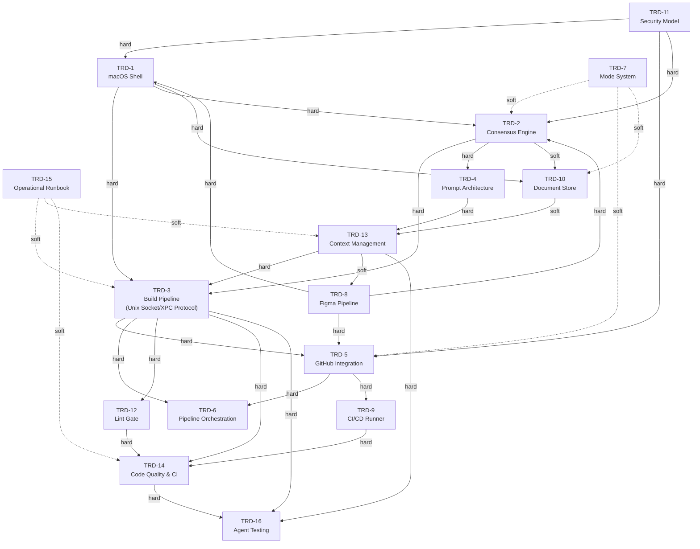

# BUILD_ORDER.md -- Canonical TRD Build Prioritization Order and Gap Analysis

> **Document Authority:** This is the single authoritative source for TRD build
> sequencing across the Crafted Dev Agent platform. All PRDs MUST derive their
> implementation order from this document. Deviations require explicit
> justification referencing this document by section number.

| Field            | Value                                                    |
|------------------|----------------------------------------------------------|
| Product          | Crafted Dev Agent                                        |
| Document         | BUILD_ORDER.md -- TRD Build Prioritization & Gap Analysis |
| Version          | 1.0                                                      |
| Status           | Active -- Canonical Reference                             |
| Author           | Forge Platform Engineering                               |
| Governing Docs   | AGENTS.md (Forge Engineering Standards), CONVENTIONS.md  |
| Architecture     | Strict two-process: Swift (UI/auth/secrets) · Python (intelligence/generation/GitHub) |
| Security Posture | Deny-by-default · Fail closed · No execution of generated code |

---

## 1. Purpose and Authority

This document establishes:

1. **Canonical build prioritization order** across all 16 TRDs (TRD-1 through TRD-16).
2. **Inter-TRD dependency graph** with explicit edges, hard vs. soft classification, and cycle resolution.
3. **TRD gap analysis** -- every missing datum, naming collision, path placement ambiguity, and undefined cross-reference discovered during dependency resolution.
4. **Best-practice decisions** to fix each identified gap, with rationale.
5. **FOUNDER mode vs. CONSULTANT mode scoping** per TRD-7 §3-6 and §21.
6. **Figma pipeline inclusion** per TRD-8 v2.0.
7. **Usage guidance for future PRDs** -- how authors cite this document and when deviations require explicit justification.

### 1.1 Why This Document Exists

Without a single canonical source:

- PRDs risk building components before their dependencies exist.
- Ambiguities in TRD cross-references (e.g., TRD-1 referencing TRD-11 security model, TRD-5 referencing TRD-9 CI runner) remain unresolved.
- Naming collisions between TRDs (e.g., `DocumentStore` appearing in multiple contexts) propagate silently.
- Mode scoping differences (FOUNDER builds everything, CONSULTANT scopes to repo) are not factored into sequencing.
- Figma pipeline support may be omitted or sequenced incorrectly.

This document eliminates those risks by forcing a full dependency walk and gap audit before any code PRDs are written.

### 1.2 Governing Invariants

All decisions in this document conform to:

- **Strict two-process model:** Swift owns UI, auth, keychain, secrets. Python owns intelligence, generation, GitHub operations.
- **No execution of generated code:** No `eval`, no `exec`, no subprocess of generated content -- ever.
- **Fail closed:** Auth, crypto, identity errors halt processing. No silent degradation.
- **Deny-by-default:** All external input (documents, PR comments, CI output) is untrusted and validated.
- **Gates wait indefinitely:** No auto-approve. Operator approval is mandatory.

---

## 2. TRD Registry

All 16 TRDs with subsystem, owner process, and summary. Each TRD appears exactly once.

| TRD   | Subsystem                          | Owner Process | Summary                                                                                         |
|-------|------------------------------------|---------------|-------------------------------------------------------------------------------------------------|
| TRD-1 | macOS Application Shell            | Swift         | Native macOS app shell: window management, XPC bridge, project schema, file layout, keychain access |
| TRD-2 | Consensus Engine                   | Python        | Dual-LLM generation with Claude arbitration, confidence scoring, prompt injection to models      |
| TRD-3 | Build Pipeline                     | Python        | End-to-end automation: PRD decomposition → PR plan → code generation → validation → CI → merge   |
| TRD-4 | Prompt Architecture                | Python        | Prompt template system, context window management, system/user prompt separation, template registry |
| TRD-5 | GitHub Integration                 | Python        | Repository operations: clone, branch, commit, push, PR creation, status checks, merge            |
| TRD-6 | Pipeline Orchestration             | Python        | Multi-PR sequencing, stage checkpoints, crash recovery, pipeline state machine                    |
| TRD-7 | TRD Development Workflow           | Both          | Mode system (FOUNDER/CONSULTANT), TRD authoring workflow, scope boundaries per mode              |
| TRD-8 | Figma Pipeline                     | Both          | Figma design token extraction, UI component generation, design-to-code pipeline                  |
| TRD-9 | CI/CD Runner Integration           | Python        | CI runner configuration, GitHub Actions integration, test execution environment, status reporting |
| TRD-10| Document Store & Retrieval Engine  | Python        | TRD/PRD storage, retrieval, indexing, context injection into consensus engine                     |
| TRD-11| Security Model                     | Both          | Authentication, authorization, secret management, token lifecycle, path validation, threat model  |
| TRD-12| Lint Gate                          | Python        | Pre-commit linting, style enforcement, lint-fix loop, blocking gate before CI submission         |
| TRD-13| Context Management                 | Python        | Context window budgeting, document chunking, relevance scoring, injection ordering               |
| TRD-14| Code Quality & CI Pipeline         | Python        | Quality metrics, CI false-positive handling, conftest.py management, test coverage enforcement    |
| TRD-15| Agent Operational Runbook          | Both          | Operational procedures, build rules console, persistent learning, failure recovery playbooks      |
| TRD-16| Agent Testing & Validation         | Python        | Agent self-test, validation harness, confidence gate contracts, schema completeness checks        |

---

## 3. Dependency Graph

### 3.1 Mermaid Diagram

### 3.2 Edge Classification Key

| Classification | Meaning                                                        | Build Impact                     |
|----------------|----------------------------------------------------------------|----------------------------------|
| **Hard**       | Target TRD cannot be implemented without source TRD existing   | Blocks implementation            |
| **Soft**       | Target TRD is enhanced by source TRD but can stub/defer        | Does not block; enhances quality |

### 3.3 Cycle Resolution

One potential cycle exists:

- **TRD-3 ↔ TRD-15:** TRD-3 (Build Pipeline) references TRD-15 (Operational Runbook) for build rules persistence, and TRD-15 references TRD-3 for pipeline procedures.
- **Resolution:** TRD-15 is placed in Tier 0 as a *standards document* (its operational content is documentation, not executable code). TRD-3 consumes TRD-15's build rules interface specification. The soft dependency from TRD-15 back to TRD-3 is deferred -- runbook procedures referencing pipeline behavior are authored after TRD-3 is implemented.

- **TRD-7 ↔ TRD-2/TRD-5/TRD-10:** TRD-7 (Mode System) depends on TRD-2, TRD-5, and TRD-10 for its workflow, but these TRDs do not depend on TRD-7.
- **Resolution:** No true cycle. TRD-7 is a consumer of earlier tiers. Its soft back-references are configuration overlays, not implementation dependencies.

---

## 4. Build Tiers

Tiers are topologically sorted. **No TRD depends on a TRD in a later tier.** Hard dependencies point only to the same or earlier tiers. Soft dependencies may point to earlier tiers or be deferred stubs.

### Tier 0 -- Foundational Standards

| TRD    | Subsystem            | Rationale                                                                                  |
|--------|----------------------|--------------------------------------------------------------------------------------------|
| TRD-11 | Security Model       | Every subsequent TRD depends on the security model: token storage, path validation, auth   |
| TRD-15 | Operational Runbook  | Defines build rules persistence, operational procedures; consumed by all pipeline TRDs     |

**Tier 0 rationale:** TRD-11 defines the security primitives (keychain access patterns, token lifecycle, path validation, threat model) that TRD-1, TRD-5, and all Python-side TRDs require. TRD-15 defines the operational framework (build rules, console outputs, file locations) that the build pipeline and recovery systems reference. Both are foundational -- implementing anything without them risks security-model misalignment or operational blind spots.

### Tier 1 -- Core Architecture

| TRD   | Subsystem            | Hard Dependencies | Rationale                                                     |
|-------|----------------------|-------------------|---------------------------------------------------------------|
| TRD-1 | macOS Application Shell | TRD-11         | Swift shell: window management, XPC bridge, project schema. Requires TRD-11 for keychain/auth patterns |
| TRD-3 | Build Pipeline (inc. Unix Socket/XPC Protocol) | TRD-1, TRD-11 | IPC protocol between Swift and Python. Build pipeline foundation. Requires TRD-1 shell and TRD-11 security |

**Tier 1 rationale:** TRD-1 is the application entry point -- without the macOS shell, no UI, no XPC bridge, no project schema exists. TRD-3 defines the build pipeline and the Unix socket / XPC protocol that all Python-side subsystems use to communicate with the Swift shell. Both require TRD-11 security primitives from Tier 0.

> **Note on TRD-3 scope:** TRD-3 v7.0 encompasses both the build pipeline engine and the IPC protocol layer (Unix socket). The IPC protocol is a Tier 1 primitive; the full pipeline orchestration logic layers on top in subsequent tiers. Implementation PRDs for TRD-3 SHOULD split into: (a) IPC/protocol layer (Tier 1), (b) pipeline engine (Tier 3, after consensus and GitHub are available).

### Tier 2 -- Intelligence Layer

| TRD   | Subsystem            | Hard Dependencies | Rationale                                                     |
|-------|----------------------|-------------------|---------------------------------------------------------------|
| TRD-2 | Consensus Engine     | TRD-1, TRD-11    | Dual-LLM generation with arbitration. Requires XPC bridge (TRD-1) and token management (TRD-11) |
| TRD-4 | Prompt Architecture  | TRD-2            | Prompt templates feed the consensus engine. Requires TRD-2 interfaces |
| TRD-10| Document Store       | TRD-1, TRD-11    | TRD/PRD storage and retrieval. Requires file layout (TRD-1) and access control (TRD-11) |

**Tier 2 rationale:** The intelligence layer provides the AI generation capability. TRD-2 (Consensus Engine) is the core -- it requires the XPC bridge from TRD-1 and auth/token patterns from TRD-11. TRD-4 (Prompt Architecture) structures the inputs to TRD-2. TRD-10 (Document Store) provides the document retrieval that feeds context into generation. TRD-10 has a soft dependency on TRD-2 (for context injection) but its storage layer depends only on TRD-1 file layout.

### Tier 3 -- Integration Layer

| TRD   | Subsystem              | Hard Dependencies       | Rationale                                                     |
|-------|------------------------|-------------------------|---------------------------------------------------------------|
| TRD-5 | GitHub Integration     | TRD-11, TRD-3 (IPC)    | Repository operations require security model for tokens and IPC for command relay |
| TRD-13| Context Management     | TRD-4, TRD-10           | Context window budgeting requires prompt architecture (TRD-4) and document store (TRD-10) |
| TRD-6 | Pipeline Orchestration | TRD-3, TRD-5            | Multi-PR sequencing requires build pipeline (TRD-3) and GitHub (TRD-5) |

**Tier 3 rationale:** This tier connects the intelligence layer to external systems. TRD-5 bridges to GitHub (requires TRD-11 for token management). TRD-13 manages context windows (requires TRD-4 prompt architecture and TRD-10 document retrieval). TRD-6 orchestrates multi-PR pipelines (requires TRD-3 pipeline and TRD-5 GitHub).

### Tier 4 -- Quality & CI

| TRD   | Subsystem              | Hard Dependencies       | Rationale                                                     |
|-------|------------------------|-------------------------|---------------------------------------------------------------|
| TRD-12| Lint Gate              | TRD-3                   | Pre-commit linting gate in the build pipeline                 |
| TRD-9 | CI/CD Runner           | TRD-5                   | CI runner integration requires GitHub Actions (TRD-5)         |
| TRD-14| Code Quality & CI      | TRD-3, TRD-9, TRD-12   | Quality metrics and CI pipeline require build pipeline, CI runner, and lint gate |

**Tier 4 rationale:** Quality enforcement layers on top of the integration tier. TRD-12 (Lint Gate) gates the build pipeline (TRD-3). TRD-9 (CI/CD) integrates with GitHub Actions (TRD-5). TRD-14 (Code Quality) ties them together with coverage and quality metrics.

### Tier 5 -- Advanced Features

| TRD   | Subsystem              | Hard Dependencies       | Soft Dependencies      | Rationale                                          |
|-------|------------------------|-------------------------|------------------------|----------------------------------------------------|
| TRD-7 | Mode System            | None (overlay)          | TRD-2, TRD-5, TRD-10  | FOUNDER/CONSULTANT mode is a configuration overlay on existing subsystems |
| TRD-8 | Figma Pipeline         | TRD-1, TRD-2, TRD-5    | TRD-13                 | Design-to-code pipeline requires shell (UI), consensus (generation), GitHub (PR output) |

**Tier 5 rationale:** These are feature extensions built on the complete platform. TRD-7 (Mode System) is an overlay -- it configures scope boundaries on TRD-2, TRD-5, and TRD-10 but does not introduce new subsystems. TRD-8 (Figma Pipeline) is a vertical feature requiring the shell (TRD-1) for Figma UI integration, the consensus engine (TRD-2) for code generation from design tokens, and GitHub integration (TRD-5) for PR output. See §9 for detailed Figma pipeline placement rationale.

### Tier 6 -- Operational & Validation

| TRD   | Subsystem              | Hard Dependencies         | Rationale                                                     |
|-------|------------------------|---------------------------|---------------------------------------------------------------|
| TRD-16| Agent Testing          | TRD-3, TRD-13, TRD-14    | Agent self-test harness requires build pipeline, context management, and code quality systems |

**Tier 6 rationale:** TRD-16 (Agent Testing & Validation) is the capstone -- it validates the entire agent by exercising the build pipeline (TRD-3), context management (TRD-13), and code quality systems (TRD-14). It must be implemented last because it tests all prior tiers.

### 4.1 Consolidated Build Order

| Order | TRD    | Tier | Subsystem                    |
|-------|--------|------|------------------------------|
| 1     | TRD-11 | 0    | Security Model               |
| 2     | TRD-15 | 0    | Operational Runbook          |
| 3     | TRD-1  | 1    | macOS Application Shell      |
| 4     | TRD-3  | 1    | Build Pipeline (IPC layer)   |
| 5     | TRD-2  | 2    | Consensus Engine             |
| 6     | TRD-4  | 2    | Prompt Architecture          |
| 7     | TRD-10 | 2    | Document Store               |
| 8     | TRD-5  | 3    | GitHub Integration           |
| 9     | TRD-13 | 3    | Context Management           |
| 10    | TRD-6  | 3    | Pipeline Orchestration       |
| 11    | TRD-12 | 4    | Lint Gate                    |
| 12    | TRD-9  | 4    | CI/CD Runner                 |
| 13    | TRD-14 | 4    | Code Quality & CI            |
| 14    | TRD-7  | 5    | Mode System                  |
| 15    | TRD-8  | 5    | Figma Pipeline               |
| 16    | TRD-16 | 6    | Agent Testing & Validation   |

---

## 5. Gap Analysis Table

Every gap discovered during the dependency walk. Each gap has a unique ID, source TRD, gap type, description, proposed resolution, and rationale.

| Gap ID | TRD Source | Gap Type              | Description                                                                                                     | Resolution                                                                                             | Rationale                                                                               |
|--------|------------|-----------------------|-----------------------------------------------------------------------------------------------------------------|--------------------------------------------------------------------------------------------------------|-----------------------------------------------------------------------------------------|
| GAP-01 | TRD-1      | Missing Data          | TRD-1 references TRD-11 security model for keychain access patterns but does not specify which TRD-11 sections define the keychain interface contract | Amend TRD-1 to cite TRD-11 §keychain-access (to be defined) and add an interface contract section to TRD-11 | Without explicit section references, implementers must guess which TRD-11 security primitives to use for keychain operations |
| GAP-02 | TRD-5      | Missing Data          | TRD-5 references TRD-9 CI runner for status check integration but TRD-9 does not define a status callback API  | Define a `CIStatusCallback` protocol in TRD-9 with typed status enum (pending, success, failure, error) | TRD-5 PR merge gates depend on CI status; without a defined callback contract, the integration is ambiguous |
| GAP-03 | TRD-3      | Missing Data          | TRD-3 v7.0 references `conftest.py` auto-commit behavior but does not specify path validation requirements per TRD-11 | Amend TRD-3 to require `path_security.validate_write_path()` before any conftest.py write operation | All file writes must be path-validated per Forge Engineering Standards; this is a security-critical gap |
| GAP-04 | TRD-2/TRD-10 | Naming Collision    | `DocumentStore` appears in TRD-10 (the retrieval engine class) and TRD-2 (as a context source interface). Different semantics | See Naming Collision Registry §6, entry NC-01                                                         | Ambiguous naming causes import collisions and semantic confusion across subsystems       |
| GAP-05 | TRD-3/TRD-6 | Naming Collision    | `PipelineState` is used in TRD-3 (build pipeline stage tracking) and TRD-6 (multi-PR orchestration state). Overlapping but distinct semantics | See Naming Collision Registry §6, entry NC-02                                                         | Two different state machines with the same name will collide in shared codebases         |
| GAP-06 | TRD-13/TRD-4 | Naming Collision   | `ContextWindow` appears in TRD-13 (budget management) and TRD-4 (prompt token allocation). Related but distinct scopes | See Naming Collision Registry §6, entry NC-03                                                         | Token counting vs. budget management are different responsibilities; shared name obscures ownership |
| GAP-07 | TRD-10     | Path Placement        | TRD-10 defines document storage paths but does not specify whether TRD/PRD files live under the project repo or a global Crafted app directory | TRD/PRD source documents stored under `~/.crafted/documents/` (global); project-scoped snapshots under `<repo>/.crafted/context/` | Global storage prevents document loss when repos are deleted; project snapshots enable offline context |
| GAP-08 | TRD-15     | Path Placement        | TRD-15 specifies build rules file location as relative path but does not resolve against TRD-1 project schema root | Build rules stored at `<repo>/.crafted/build_rules.json` per TRD-1 project schema conventions        | Consistent with TRD-1 `.crafted/` directory convention; avoids root-level config file pollution |
| GAP-09 | TRD-8      | Path Placement        | TRD-8 v2.0 does not specify where Figma design tokens are cached locally                                        | Figma tokens cached at `<repo>/.crafted/figma/tokens.json` with path validation via TRD-11            | Follows `.crafted/` convention; path validation prevents directory traversal attacks      |
| GAP-10 | TRD-7      | Missing Data          | TRD-7 §21 (CONSULTANT mode) references "scoped to existing repo" but does not enumerate which TRDs are excluded | Define CONSULTANT exclusion list: TRD-1 (shell already exists), TRD-8 (Figma not applicable). See §8 Mode Scoping Matrix | CONSULTANT mode operates on existing repos; shell creation and Figma pipelines are FOUNDER-only concerns |
| GAP-11 | TRD-14     | Missing Data          | TRD-14 references TRD-2 Consensus Engine for quality score arbitration but does not define the quality score schema | Define `QualityScore` schema in TRD-14 with fields: `lint_pass: bool`, `test_coverage: float`, `ci_status: str`, `confidence: float` | Without a schema, quality scoring is implementation-defined and non-portable across pipeline stages |
| GAP-12 | TRD-16     | Missing Data          | TRD-16 v3.1 references "confidence gate contract" but the contract schema is not defined in any TRD             | Define `ConfidenceGateContract` in TRD-16 with fields: `threshold: float`, `source_trd: str`, `gate_type: enum(hard, soft)`, `auto_approve: Never` | The `auto_approve: Never` constraint is a Forge invariant; making it explicit in the schema prevents bypass |
| GAP-13 | TRD-3/TRD-14 | Undefined Reference | TRD-3 references TRD-13 v6 for context injection, but TRD-13 version in registry is v1.0 -- version mismatch    | Treat TRD-3's reference as targeting TRD-13 latest; amend TRD-3 header to reference TRD-13 without version pin | Version-pinned cross-references become stale; reference by TRD number with "latest" semantics |
| GAP-14 | TRD-11     | Missing Data          | TRD-11 is referenced by 12 other TRDs but no TRD-11 document was provided in context -- its internal structure is assumed | Prioritize TRD-11 authoring/review as first implementation action; all security assumptions in this document are provisional until TRD-11 is ratified | Security model gaps are the highest-risk category; fail closed by flagging this explicitly |
| GAP-15 | TRD-9      | Missing Data          | TRD-9 is referenced by TRD-5 and TRD-14 but no TRD-9 document was provided in context -- CI runner interface is assumed | Prioritize TRD-9 authoring/review; provisional interface defined in GAP-02 resolution | CI integration without a defined runner contract risks false-positive/negative test results |
| GAP-16 | TRD-4      | Missing Data          | TRD-4 is referenced by TRD-2 and TRD-13 but no TRD-4 document was provided in context -- prompt architecture is assumed | Prioritize TRD-4 authoring/review; provisional interface: prompt templates as typed dataclasses with context/system/user slots | Prompt architecture defines the LLM input contract; without it, consensus engine integration is speculative |
| GAP-17 | TRD-12     | Missing Data          | TRD-12 (Lint Gate) is referenced by TRD-3 and TRD-14 but no TRD-12 document was provided in context             | Prioritize TRD-12 authoring/review; provisional: lint gate is a blocking pre-commit check with typed result (pass/fail/error list) | Lint gate is a security gate (prevents malformed code from reaching CI); its contract must be explicit |

---

## 6. Naming Collision Registry

Every term that appears in multiple TRDs with different or overlapping meanings.

| NC ID  | Term              | TRD Appearances          | Meaning in Each TRD                                                                     | Resolution                                                                                         | Affected TRDs   |
|--------|-------------------|--------------------------|-----------------------------------------------------------------------------------------|----------------------------------------------------------------------------------------------------|------------------|
| NC-01  | `DocumentStore`   | TRD-10, TRD-2            | **TRD-10:** The retrieval engine class responsible for indexing and querying TRD/PRD documents. **TRD-2:** A context source interface that provides documents to the consensus engine | Rename TRD-2 usage to `ContextSource` or `DocumentProvider`. `DocumentStore` is reserved for TRD-10's retrieval engine per CONVENTIONS.md | TRD-2, TRD-10    |
| NC-02  | `PipelineState`   | TRD-3, TRD-6             | **TRD-3:** Build pipeline stage tracking (e.g., generating, testing, linting). **TRD-6:** Multi-PR orchestration state (e.g., PR-1-complete, PR-2-pending) | Prefix with subsystem: `BuildPipelineState` (TRD-3) and `OrchestrationState` (TRD-6) per CONVENTIONS.md naming rules | TRD-3, TRD-6     |
| NC-03  | `ContextWindow`   | TRD-13, TRD-4            | **TRD-13:** Budget management object tracking total tokens allocated across all context sources. **TRD-4:** Prompt-level token allocation within a single LLM call | Rename TRD-4 usage to `PromptTokenBudget`. `ContextWindow` is reserved for TRD-13's budget manager | TRD-4, TRD-13    |
| NC-04  | `BuildRule`       | TRD-15, TRD-3            | **TRD-15:** Persistent learning rule stored in build rules console. **TRD-3:** Inline pipeline constraint (e.g., "always run lint before test") | Rename TRD-3 usage to `PipelineConstraint`. `BuildRule` is reserved for TRD-15's persistent learning system | TRD-3, TRD-15    |
| NC-05  | `Checkpoint`      | TRD-6, TRD-16            | **TRD-6:** Per-PR stage checkpoint preventing re-execution after crash. **TRD-16:** Validation checkpoint in the agent test harness | Prefix with subsystem: `StageCheckpoint` (TRD-6) and `ValidationCheckpoint` (TRD-16)              | TRD-6, TRD-16    |
| NC-06  | `SecurityGate`    | TRD-11, TRD-12           | **TRD-11:** Authorization check point in the security model. **TRD-12:** Lint-based security pattern check (e.g., no hardcoded secrets) | Rename TRD-12 usage to `LintSecurityCheck`. `SecurityGate` is reserved for TRD-11's auth checkpoints | TRD-11, TRD-12   |

---

## 7. Path Placement Ambiguities

All file path ambiguities discovered during the dependency walk, with resolutions.

| Path ID | TRD Source | Ambiguous Path                          | Context                                                                          | Resolved Path                                   | Rationale                                                                                |
|---------|------------|-----------------------------------------|----------------------------------------------------------------------------------|--------------------------------------------------|------------------------------------------------------------------------------------------|
| PATH-01 | TRD-10     | TRD/PRD document storage location       | TRD-10 defines storage but not whether global or project-scoped                  | Global: `~/.crafted/documents/`; Project snapshot: `<repo>/.crafted/context/` | Global prevents loss on
